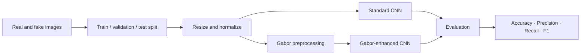

<div align="center">

# Deepfake Image Detection with CNN & Gabor Filters

### A comparative static-image forensic pipeline using standard and Gabor-enhanced convolutional neural networks

[](https://www.python.org/)
[](https://www.tensorflow.org/)

<br />


</div>

## Research at a glance

| | |
|---|---|
| **Task** | Binary classification of real and deepfake face images |
| **Comparison** | Standard CNN vs. CNN with Gabor-filter preprocessing |
| **Input** | 256 × 256 RGB images |
| **Published best approach** | Gabor-enhanced CNN |
| **Published results** | **95% accuracy · 0.92 precision · 0.95 recall · 0.93 F1-score** |

The study evaluates whether direction- and frequency-aware texture features produced by Gabor filters improve a CNN's ability to identify manipulated facial imagery. The reported metrics above are the published results for the Gabor-enhanced model; they are not measurements inferred from the small demonstration images included in this repository.

## Method



- **Standard CNN:** learns spatial features directly from normalized RGB images through convolution, pooling, and dense layers.
- **Gabor-enhanced CNN:** applies oriented Gabor responses to emphasize texture and frequency artifacts before classification.
- **Evaluation:** compares both approaches using classification metrics on held-out data.

## Repository layout

```text
deepfake-image-detection-cnn/
├── notebooks/
│   ├── 01_gabor_preprocessing.ipynb
│   ├── 02_standard_cnn_training.ipynb
│   ├── 03_standard_cnn_evaluation.ipynb
│   └── 04_gabor_cnn.ipynb
├── assets/
│   └── test-images/
├── CITATION.cff
├── requirements.txt
└── README.md
```

| Notebook | Purpose |
|---|---|
| `01_gabor_preprocessing.ipynb` | Generate Gabor-filter representations from source images |
| `02_standard_cnn_training.ipynb` | Define and train the baseline CNN |
| `03_standard_cnn_evaluation.ipynb` | Load the standard model and inspect predictions |
| `04_gabor_cnn.ipynb` | Train and evaluate the Gabor-enhanced CNN |

## Run the notebooks

```bash
git clone https://github.com/rahultripathi17/deepfake-image-detection-cnn.git
cd deepfake-image-detection-cnn

python -m venv .venv
# Windows: .venv\Scripts\activate
# macOS/Linux: source .venv/bin/activate

python -m pip install --upgrade pip
pip install -r requirements.txt
jupyter lab
```

Use a dataset layout equivalent to:

```text
Dataset/
├── Train/
│   ├── Real/
│   └── Fake/
├── Validation/
│   ├── Real/
│   └── Fake/
└── Test/
    ├── Real/
    └── Fake/
```

> [!IMPORTANT]
> The dataset and trained model weights are not distributed in this repository. Some notebooks retain their original Google Colab or Kaggle paths for research traceability; update those paths for your environment before running them.

## Project timeline

- **31 March 2024:** source notebooks and initial documentation committed publicly.
- **2024:** comparative CNN and Gabor-CNN experiments developed and evaluated.
- **3 May 2025:** peer-reviewed Springer chapter published online.
- **27 August 2025:** publication DOI added to the repository.
- **30 August 2026:** repository structure, reproducibility notes, and research documentation refreshed.
