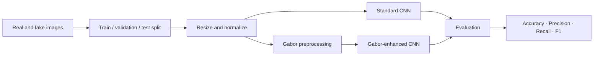

<div align="center">

# Deepfake Image Detection with CNN & Gabor Filters

### A comparative static-image forensic pipeline using standard and Gabor-enhanced convolutional neural networks

[](https://www.python.org/)
[](https://www.tensorflow.org/)

<br />


</div>

## Research at a glance

| | |
|---|---|
| **Task** | Binary classification of real and deepfake face images |
| **Comparison** | Standard CNN vs. CNN with Gabor-filter preprocessing |
| **Input** | 256 × 256 RGB images |
| **Published best approach** | Gabor-enhanced CNN |
| **Published results** | **95% accuracy · 0.92 precision · 0.95 recall · 0.93 F1-score** |

The study evaluates whether direction- and frequency-aware texture features produced by Gabor filters improve a CNN's ability to identify manipulated facial imagery. The reported metrics above are the published results for the Gabor-enhanced model; they are not measurements inferred from the small demonstration images included in this repository.

## Method



- **Standard CNN:** learns spatial features directly from normalized RGB images through convolution, pooling, and dense layers.
- **Gabor-enhanced CNN:** applies oriented Gabor responses to emphasize texture and frequency artifacts before classification.
- **Evaluation:** compares both approaches using classification metrics on held-out data.

## Repository layout

```text
